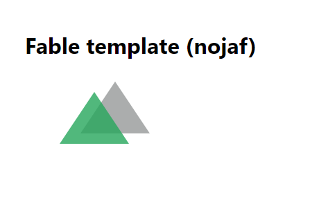

# Minimal fable template



## Install

> dotnet new -i Fable.Template.nojaf

## Create

> dotnet new fable-nojaf -n myApp

## Install dependencies

> cd myApp

> yarn install

Installs node and dotnet dependencies.

## Develop

> yarn start

Starts Fable (compile F# to js) and [parcel](https://parceljs.org/) (bundles and serves files).

Open [http://localhost:8080](http://localhost:8080) to access the dev server.

## Unit test

> yarn test

Or

> yarn test:watch

Calls `jest` to run the tests in the compiled files. (Run `yarn compile` first if no JS files are present in `output` folder).

Most likely you want to run tests and see something in your browser.
Run `yarn start` in one console and `yarn test:watch` in another.
This is handy to see both Fable compilation errors as well as unit test issues at the same time.

## Clean

> yarn clean

Remove caches and compiled JS

## Adding Elmish

This template does not contain any Elmish references whatsoever.

Add 
```
nuget Fable.React 5.0.0-alpha-004
nuget Fable.Elmish 3.0.0-beta-4
nuget Fable.Elmish.React  3.0.0-beta-1
nuget Fable.Elmish.Debugger 3.0.0-beta-2
```
to your paket.dependencies

and 
```
Fable.React
Fable.Elmish
Fable.Elmish.React
Fable.Elmish.Debugger
```

to paket.references

`paket install`

Add React or Preact:

> yarn add react react-dom

> yarn add preact preact-compat

If you chose preact add

```
  "alias": {
    "react": "preact-compat",
    "react-dom": "preact-compat"
  },
```

to your package.json.

Minimal Elmish sample code:
```fsharp
open Elmish
open Elmish.React
open Fable.Helpers.React
open Elmish.Debug

type Model = int

let init _ = 0, Cmd.none

let update model _ = model, Cmd.none

let view dispatch model = div [] [str "empty app"]

Program.mkProgram init update view
|> Program.withConsoleTrace
|> Program.withReact "elmish-app"
|> Program.run
```

And add `<div id="elmish-app"></div>` to `/output/index.html`.
